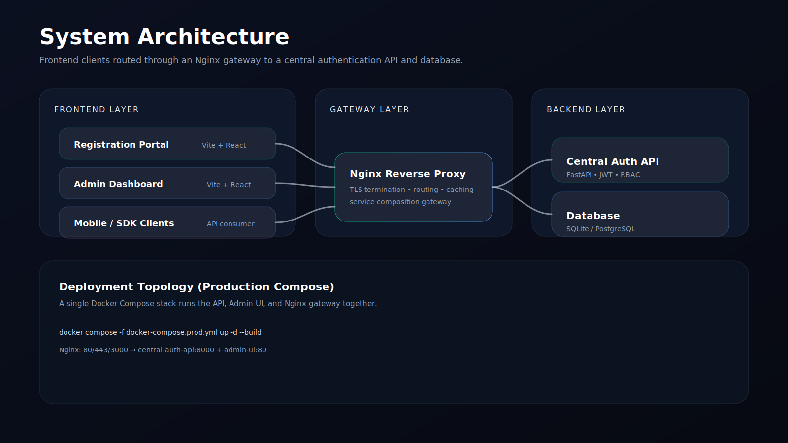
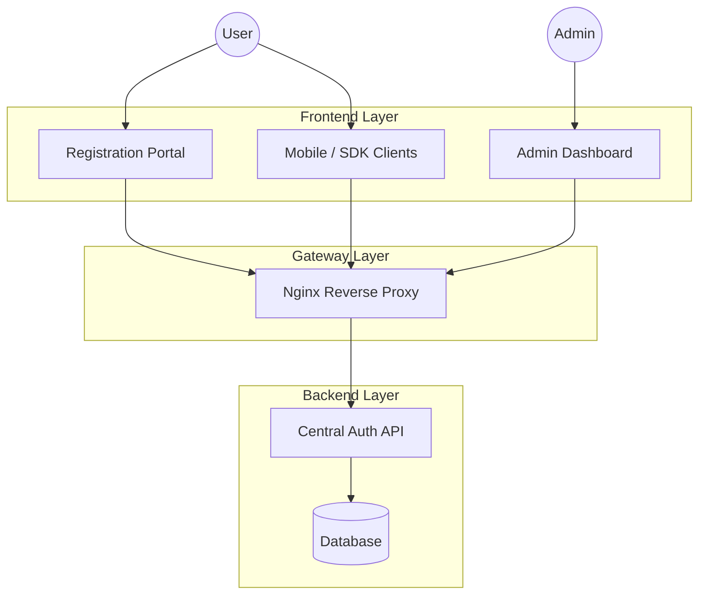
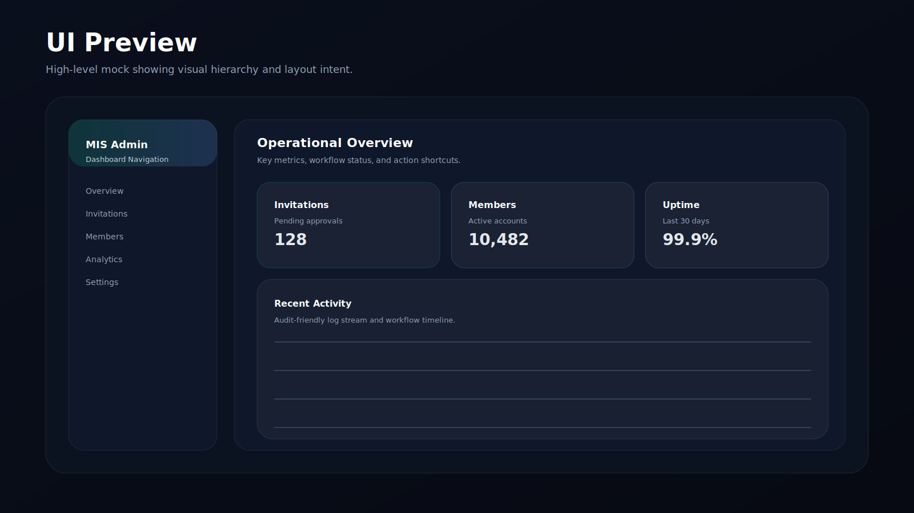

# MIS System (Membership Initiation System)

<div align="center">
  
</div>

<div align="center">
  <a href="#"></a>
  <a href="#"></a>
  <a href="#"></a>
  <a href="#"></a>
</div>

<p align="center">
  MIS System is a modular platform for secure identity, administrative oversight, and guided onboarding across web, mobile, and API clients.
</p>

## Overview

MIS System brings three primary capabilities together:

- Central authentication and authorization (JWT, roles, audit-friendly flows)
- Administrative dashboard for invitations, member lifecycle, and operational visibility
- Public registration portal for guided onboarding and validation

## Contents

- [Architecture](#architecture)
- [Modules](#modules)
- [Production Deployment](#production-deployment)
- [Local Development](#local-development)
- [Configuration](#configuration)
- [Security](#security)
- [Media & Licensing](#media--licensing)

## Architecture

<div align="center">
  
</div>

GitHub also renders a live diagram below for quick scanning:



## Modules

| Module | Path | Purpose | Tech |
| --- | --- | --- | --- |
| Central Auth API | `MIS_SYSTEM-ENGINE_[SE]/central-auth-api/` | Authentication, JWT issuance, admin workflows | FastAPI |
| Admin UI | `MIS_SYSTEM-ENGINE_[SE]/admin-ui/` | Admin dashboard and operational tools | React, Vite |
| Registration Portal | `MIS_REGISTRATION-SYSTEM_[RS]/` | Public onboarding and registration flow | React, Vite |
| Login System | `MIS_LOGIN-SYSTEM_[LS]/` | Client SDKs / mobile integrations | Client-side |

## Production Deployment

The production stack runs as a single compose project and includes:

- `central-auth-api` (backend)
- `admin-ui` (frontend)
- `auth-nginx` (gateway)

From the repository root:

```bash
docker compose -f docker-compose.prod.yml up -d --build
```

Endpoints (default):

| Service | URL | Notes |
| --- | --- | --- |
| API (via gateway) | `http://localhost/` | Reverse-proxied by `auth-nginx` |
| Admin UI | `http://localhost:3000/` | Admin portal |
| API docs | `http://localhost/docs` | Swagger UI |

## Local Development

Common workflows:

- Registration Portal:
  - `cd MIS_REGISTRATION-SYSTEM_[RS]`
  - `npm install`
  - `npm run dev`
- Admin UI:
  - `cd MIS_SYSTEM-ENGINE_[SE]/admin-ui`
  - `npm install`
  - `npm run dev`
- Central Auth API:
  - `cd MIS_SYSTEM-ENGINE_[SE]/central-auth-api`
  - run via your Python environment (FastAPI)

<div align="center">
  
</div>

## Configuration

Key configuration is managed via environment variables and compose configuration:

- Database: `DATABASE_URL` (SQLite or PostgreSQL)
- Production flags: `PRODUCTION`, `DEBUG_MODE`
- Frontend API base URL: `VITE_API_BASE_URL`

Refer to `docker-compose.prod.yml` for the production wiring.

## Security

Security posture and engineering practices:

- Password hashing with bcrypt
- Token-based auth (JWT)
- Input validation via strict schemas
- Separation of concerns between gateway, API, and UIs

## Media & Licensing

- Images in `assets/readme/` are generated SVGs included in this repository.
- Badge images are served by shields.io and are subject to their own terms.
